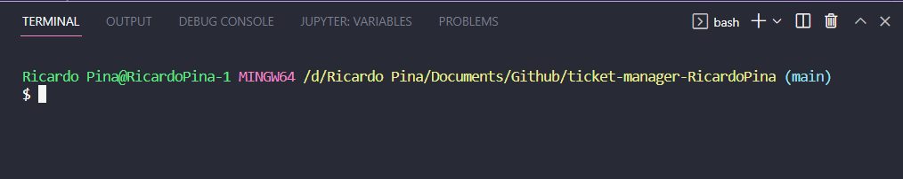
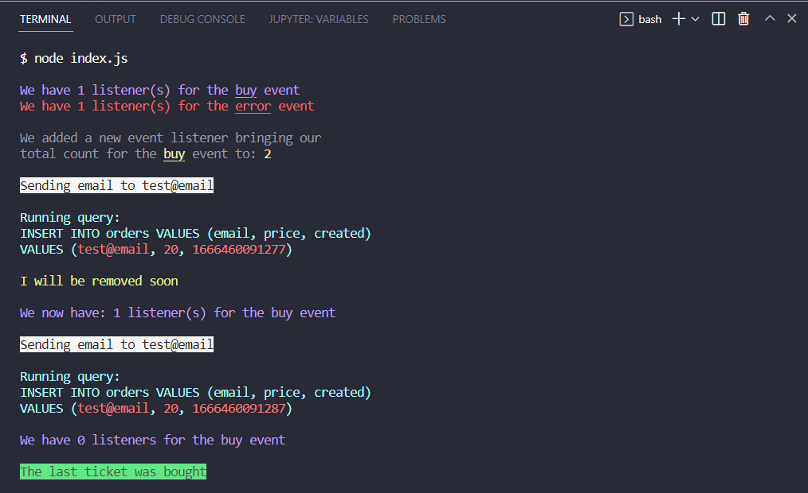

# Ticket Manager

This application doesn't have real functionality, it only serves to illustrate how event listeners and emitters work.

## There are 4 Main Parts

1. **Ticket Manager**: the ticket manager class emits an event when a ticket is bought. If the client tries to purchase a ticket when they are no longer in stock, it emits an error.

2. **Email Service**: the email service class mocks a class that sends an email whenever a ticket is purchased.

3. **Database Service**: the database service class mocks a class that saves the email of the client, the price of the ticket, and the timestamp of when the ticket was purchased.

4. **Index**: the index.js file is the main entry point of the application. It contains a listener for the 'buy' emitted by the ticket manager whenever a ticket is bought and a listener for whenever an error occurs. The rest of the file has hard-coded examples that show how classes, emitters, and listeners work together.

## Running the app

1. First, open your terminal of choice and go to the apps directory. I use the integrated bash terminal in VSCode:

2. Then type `node index.js` into the terminal and press enter.

3. That's it! The terminal should output the following:

The terminal was styled using [Chalk v4.1.2](https://github.com/chalk/chalk/releases#:~:text=Compare-,v4.1.2,-Readme%20updates).
